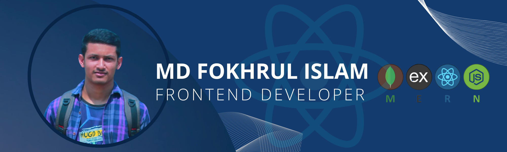

<h2 align="center">hey there, I'm Fokhrul ✌</h2>

###

  

###

Enthusiastic Front-End Developer with a focus on React.js, eager to apply theoretical knowledge gained through coursework to real-world projects. Skilled in creating dynamic user interfaces and passionate about learning and adapting to emerging technologies in the field. Excited to contribute to innovative projects and grow within a collaborative team environment.

###

Below are a few links you can visit for statistics and contact information:

###

  
  
  
  
  
  
  

###

<h2 align="center">🛠 Languages and Tools</h2>

###

  
  
  
  
  
  
  
  
  
  
  
  
  
  
  
  
  
  
  
  
  
  
  
  
  
  
  

###

<h3 align="center">🤞 Trophies 🤞</h3>

###

  

###

<h3 align="center">⚡ Stats ⚡</h3>

###

  
  
  

###